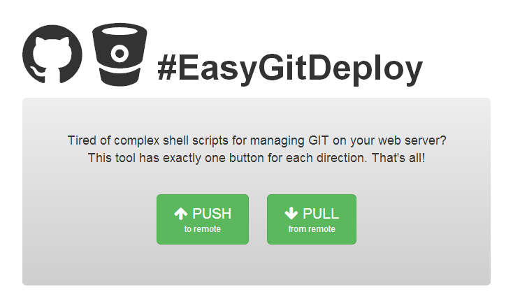

## #EasyGitDeploy

Tired of complex shell scripts for managing GIT on your web server?  
This tool has exactly one button for each direction. That's all!

EasyGitDeploy targets the following setup: Your are developing with git and remote repository (e.g. GitHub or BitBucket). To handle deployments for smaller projects (e.g. Static websites, Wordpress, etc.) you would like to deploy a branch directly to the webserver (by default 'master' is used). As soon as everything works as expected, you just have to use the _PULL_ button to either create a new git-driven directory on the webserver or to update the existing directory. This works as long as no file-changes were made on the webserver (e.g. automatic wordpress updates or uploaded user-content).

If there are any conflicting changes, the _PUSH_ button is here to rescue. It creates a new branch and pushes the changes to the remote repository. Now it’s up to you to merge the new branch back to master. As soon as this was made, _PULL_ will work again and brings the project on the webserver back to the latest version.

## Requirements on the web server
* Linux / Unix (or [Cygwin](http://www.cygwin.com/) on Windows)
* PHP 5.4
* git command line tool  

## Expected Conflict resolvements

| Dev             | Live          | Push Button            | Pull Button                                                                                                        | What to do?                                                                                |
|:--------------- |:--------------|:-----------------------|:-------------------------------------------------------------------------------------------------------------------|:-------------------------------------------------------------------------------------------|
| Unchanged       | Unchanged     | New Branch (unchanged) | No changes                                                                                                         |                                                                                            |
| Unchanged       | **Changes**   | New Branch             | If on other Branch with open changes, cannot checkout master, nothing happens.                                     | Nothing to do, but if you are not sure if dev is unchanged do 1st push and 2nd pull again. |
| **New Commits** | Unchanged     | New Branch (unchanged) | Live receives latest version of master branch.                                                                     |                                                                                            |
| **New Commits** | **Changes**   | New Branch             | 1. On master: updates or conflicts. 2. On other Branch with open changes, cannot checkout master, nothing happens. | On any problems, push first, maybe resolve conflicts on dev and pull again.                |

## Licence

The MIT License (MIT), Copyright (c) 2017 Johannes Hoppe  
see [License text](LICENSE)  
  
Many thanks to Brandon Summers for the [initial code](http://brandonsummers.name/blog/2012/02/10/using-bitbucket-for-automated-deployments/).  
Thanks to [Pascal Dittrich](http://www.pad-soft.de/) for feedback and code attributions.  
